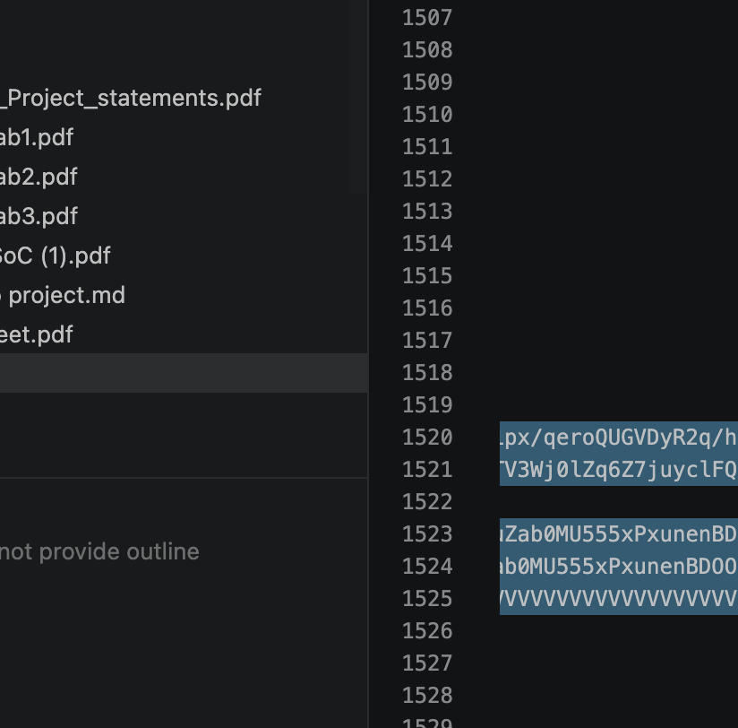

### 📘 Lab 1 : Interfaces et Capteurs
Ce labo gère votre interface utilisateur et la "vision" de l'automate.

* **Boutons et LEDs :** Configuration des entrées/sorties de base (GPIO).
* **Écran LCD :** Affichage des actions ("Jump", "Duck") et du score via les fonctions `LCD_Char_...`.
* **Clavier :** Mappage des touches avec `keypadScan()`.
* **Photorésistances :** Détection des obstacles et de la luminosité en utilisant l'ADC (Convertisseur Analogique-Digital).

### 📙 Lab 2 : Temps et Audio
Ce labo gère la logique interne et le son.

* **Score (Chronomètre) :** Utilisation des Timers pour gérer l'incrémentation du score dans le temps.
* **Fiabilité du Score :** Utilisation des Interruptions (ISR) liées au Timer pour que le score s'incrémente en arrière-plan sans bloquer la lecture des capteurs.
* **Bruitages :** Génération des sons via le DAC (Convertisseur Digital-Analogique).

### 📕 Lab 3 : Actionneurs et Communication
Ce labo permet à l'automate d'agir physiquement et de communiquer.

* **Servomoteurs :** Contrôle physique des frappes sur le clavier en générant des signaux PWM.
* **Port Série (UART) :** Communication bidirectionnelle avec le PC (envoi d'états et réception des commandes comme "jump" ou "duck" via interruption).

